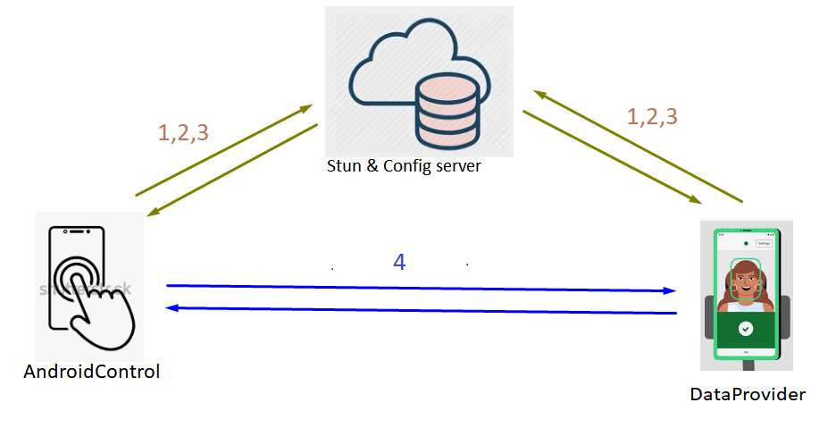

# Jackal
Эта система позволяет передавать данные с минимальной задержкой через сети 3G/4G без постоянного использованя публичного сервера типа Zoom, WhatsApp и т.д.
Данные идут напрямую (как в Skype или Torrent)
Но для установления соединения публичный сервер все равно нужен. Это может быть не обязательно самописный rest-сервис, но и Viber со своим API или Google firebase (вернемся к этому позже)

## Процесс установления соединения

Участники 
- AndroidControl: Устройство с помощью которого вы отправляете команды и просматриваете видеоданные
- DataProvider: Устройство которые умеет отправлять данные с камеры и принимать команды управления (влево, вправо, огонь и т.д.)

Порядок установления связи
1. Сначала каждый из учатсников узнает свой внешний IP адрес (используя публичные Stun серверы, можно написать и свой публичный UDP-сервер)
2. Публикация в Config сервере своего локального и публичного IP, а также публикация открытого ключа
3. Неприрывный опрос второго участника. Если участник появился и он свежий, идет взаимная отправка UDP пакетов друг другу по ВСЕМ портам. Некоторые Wi-fi роутеры на этом этапе отваливаются. иногда подключение проходит с 3-4 попытки. 
4. После пробития дыры. идет обмен пакетами (в том числе видеоданными) на прямую. В этом режиме используется быстрое синхронное шифрование.

## Описание внутреннего устройства
Основная логика написана на Java 8 (для совместимости с Android). эти библиотеки также можно использовать на Raspberry Pi или Desktop приложении (windows/linux).

DataProvider получает картинки с камеры, отправляет их через unix-pipe в native-c программу, она преобразовывает изображение в видеофрейм и по другому unix-pipe отправляет видеофрейм обратно в Java.
Далее этот фрейм делится на маленькие кусочки (по килобайту) распараллеливается, шифруется и отправляется в AndroidControl. 

AndroidControl получает части фрейма, склеивает их, преобразует видеофрейм в картинку и отрисовывает как bitmap на экране. Если вдруг какой-то фрейм не дошел полностью, а следующий за ним дошел и он является I-Frame то он отрисовывается не дожидаясь предыдущего.

Что касается железа, то DataProvider имеет Bluetooth подключение к аппаратной части (это может быть микроконтроллер + Bluetooth модуль либо RaspberryPi c Wi-fi подключением к DataProvider или просто проводом в случае если есть OTG).
Пакеты от AndroidControl идут сквозь DataProvider к железу. 