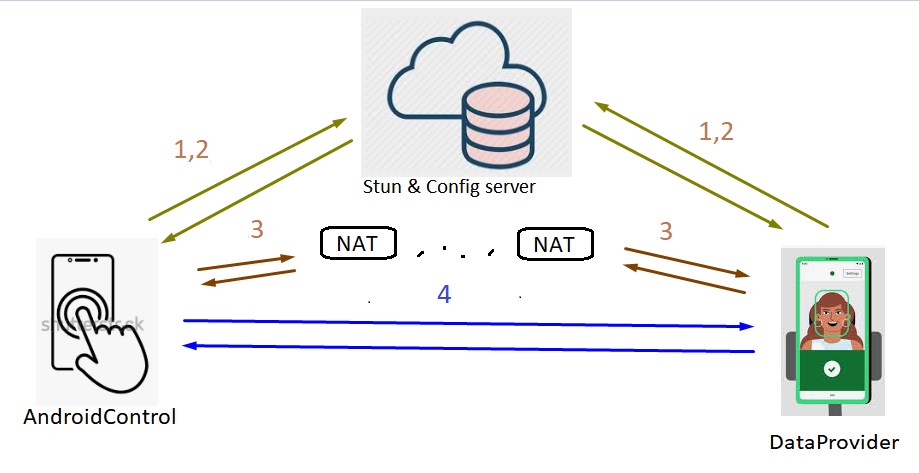

# Jackal
Эта система позволяет передавать данные с минимальной задержкой через сети 3G/4G без постоянного использованя публичного сервера (как делает Zoom, WhatsApp и т.д.)
Данные идут напрямую (как в Skype или Torrent)
Но для установления соединения публичный сервер все равно нужен. Это может быть не обязательно самописный rest-сервис, но и Viber со своим API или Google firebase (вернемся к этому позже)

## Процесс установления соединения

Участники 
- **AndroidControl**: Устройство с помощью которого вы отправляете команды и просматриваете видеоданные
- **DataProvider**: Устройство которые умеет отправлять данные с камеры и принимать команды управления (влево, вправо, огонь и т.д.)
- **ConfigServer** используется на первом этапе. нужен для того чтобы узнать IP другого участника и для обмена открытым ключом. На данный момент есть одна реализация для NodeJs (связано с тем, что есть бесплатные серверы NodeJs, где ненужно оставлять денежный след).

Порядок установления связи
1. Сначала каждый из учатсников узнает свой внешний IP адрес (используя публичные Stun серверы, можно написать и свой публичный UDP-сервер)
2. Публикация в Config сервере своего локального и публичного IP, а также публикация открытого ключа
3. Неприрывный опрос второго участника. Если участник появился и он свежий, идет взаимная отправка UDP пакетов друг другу по ВСЕМ портам. Некоторые Wi-fi роутеры на этом этапе отваливаются. иногда подключение проходит с 3-4 попытки. 
4. После пробития дыры. идет обмен пакетами (в том числе видеоданными) на прямую. В этом режиме используется быстрое синхронное шифрование.

## Описание внутреннего устройства
Основная логика написана на Java 8 (для совместимости с Android). эти библиотеки также можно использовать на Raspberry Pi или Desktop приложении (windows/linux).

DataProvider получает картинки с камеры, отправляет их через unix-pipe в native-c программу, она преобразовывает изображение в видеофрейм и по другому unix-pipe отправляет видеофрейм обратно в Java.
Далее этот фрейм делится на маленькие кусочки (по килобайту) распараллеливается, шифруется и отправляется в AndroidControl. 

AndroidControl получает части фрейма, склеивает их, преобразует видеофрейм в картинку и отрисовывает как bitmap на экране. Если вдруг какой-то фрейм не дошел полностью, а следующий за ним дошел и он является I-Frame то он отрисовывается не дожидаясь предыдущего.

Что касается железа, то DataProvider имеет Bluetooth подключение к аппаратной части (это может быть микроконтроллер + Bluetooth модуль либо RaspberryPi c Wi-fi подключением к DataProvider или просто проводом в случае если есть OTG).
Пакеты от AndroidControl идут сквозь DataProvider к железу. 
На видео с демо используется Bluetooth модуль DSD-TECH HM10. у него максимальный битрейд 115200, но для передачи комманд этого достаточно.

## Подробное описание

Начнем с железа, так как там рефакторинг ненужен

### DataProvider Hardware
Как показано на схеме - это микроконтроллер stm32 + bluetooth.

весь код разделен на 2 части Kernel и Port

**Kernel** не использует специфичных к конкретному микроконтроллеру частей.
Его части по-возможности мало связаны. эти части отдельно протестированы на Linux desktop (директория project/hardwarecontrol/tests)
- soft_timers - программные таймеры
- rolling_buf - круговой буфер. Нужен для принятия данных по UART. С помощью DMA заполняем его и когда есть время смотрим на сколько заполнен. смещаем индексы и т.д.
- packer_receiver - довольно сложный получатель пакетов. используется как в Java так и в С. Он универсален. ему на вход надо поставить "Поисковик начала пакета", "Проверятель не пришел ли пакет полностью", "Драйвер интерфейса, который сообщит текущую скорость", "Приемщик готовго пакета"
- movement_manager - модуль получающий пакеты от Android и управляющий моторами вертикальной наводки и горизонтальной наводки

**Port** (сейчас только один project/hardwarecontrol/port_stm32_hm10_2) Это микроконтроллер stm32 + bluetooth модуль hm10
- hm10 link и прочее. Эта подсистема 
    - пингует доступен ли модуль Шлет команы AT и ждет ОК. Данный модуль не отправляет CrLf, так что приходится опираться на таймауты. 
    - Устанвливает скорость подключения. 
    - После установления связи конфигурирует ему имя. 
    - Далее ждет подключения. Данный модуль может подвисать, поэтому подключен через PNP транзистор, чтобы можно было его отключать полностью и подтягивать все пины к земле.
- movement_driver - работает в паре с movement_manager и устанавливает DAC значения для управления силовым MOSFET через операционный усилитель.
- осуществляет "тики" всех модулей через main(), а также тактирует soft_timer железным таймером. RTOS не сипользуется в данном порте так как, надо быть уверенным что все будет работать и на более слабом железе типа Atmel tiny

### Сборка
Для того чтобы проет собрался нужно подключить каталог Kernel с помощью команды Linux ln -s ... ... чтобы получилось как на картинке

далее вызвать команду cmake
Но я бы посоветывал использовать JetBrains CLion

### Описание передачи видео. 
Я бы посоветывал открыть изображение ниже на втором окне или распечатать.

Внутри DataProvider есть источник изображения в формате YUV
Он производит новое изображение 24-25 в секунду (Frame rate)
Эти изображения отправляются по Unix pipe из Java в С. Библиотека называется native-lib.
Эта библиотека работает в своем потоке, использует packet_receiver (тот-же что и в 
микроконтроллере ) получает изображение за изображением (на получение 1-го изображения уходит 
1-2 мс)
После конвертации изображения в I-Frame или P-Frame идет обратная передача по другому Unix pipe.
I-Frame - это сжатаое изображение, которое может конвертироваться обратно в картинку.
P-Frame - это изменения отностильно предидущего I-Frame или P-Frame.
Выглядит это примерно так IPPPPPPPPPPIPPPPPPPPPIPPPPPPPPP. I-Frame передается каждые 2 секунды
Когда Java получает сконвертированную в фрейм картинку, она разбивает его на блоки в 1.5кб чтобы избежать фрагментации UDP пакетов. 
и в зависимости от имплементации DataPipe Передает их получателю изображения.

Получатель AndroidControl делает обратное преобразование.
ждет пока получит пакет инициализации VideoHeaderPacket после чего инициализирует Декодер
далее дожидается первого I-Frame и посылает его в декодер. Затем посылает P-Frame.
Если в процессе приема произошлы траблы с получением P-Frame, то ожидаем следующего I-Frame
и отображаем его. Короче, если есть свеженький I-Frame отображаем его.

Таким образом в лучшем случае, пока DataProvider получает новую картинку, AndroidControl уже отображает предыдущую.

Однако для сетей 3G/4G предусмотрено перезапрос потерянных фреймов. Если анализатор на приеме считает что пора бы уже прийти полностью фрейму (или мы начали принимать следующий, а предыдущий еще не пришел) мы можем перезапросить недостающие части фрейма - пакет называется LacksRequest.
И CachedVideoProducer должен их переотправить. В этом случае задержка может составлять до 200мс.

Примерные величины для изображения 320х240 
размер YUV - 115200 Byte
размер I-Frame - 20 kByte
размер P-Frame - 4-8 kByte
количество блоков - 4-15 блоков
Таким образом при скорости подключения 1.5Мбит/с = 150кБайт мы передаем один I-Frame 20кБайт + (24*5=120кБайт) 130кБайт/с 
Однако если изменений много (в изображении либо есть вибрации, то P-Frame будут велики и придется уменьшать разрешение.

В общем это целая отдельная задача - сделать автоматическое уменьшение Frame rate или Image resolution при частых LacksRequest.

